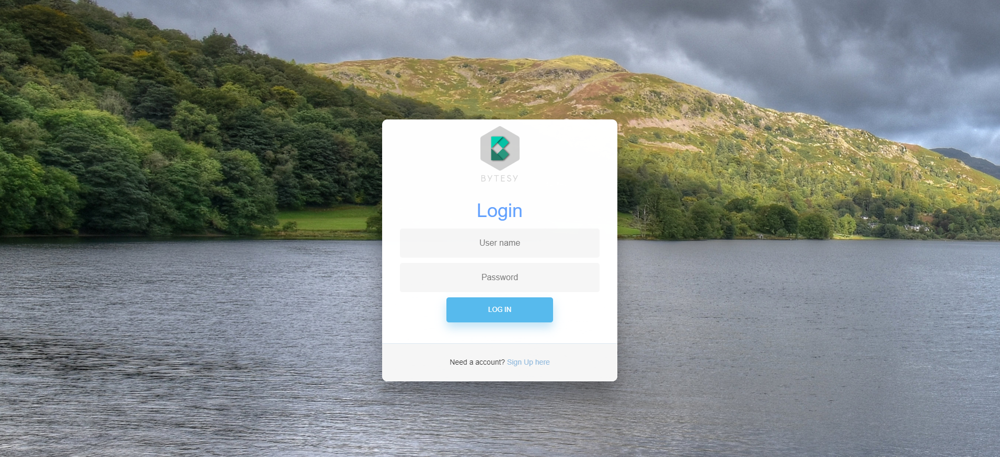

# Bytesi user Login System
 

## instruction:
	1. Download the project in your local machine and import it your favourite IDE as maven project.
	2. Change Mysql database database name and password from application.properties file. database will create automaticly .so no need to create database schema.
	3. Then run project as Spring boot app.
	4. Hit the url in your browser address bar like http://localhost:8080/

## Run app as a war file:
	1. Go to project diretory from terminal.
	2. Run this command = mvn clean install
	3. After successfull build you will find a war file in  \bytesy-user-login-system\target directory.
	4. Then copy the war file and paste it on your tomcat webapps directory.
	5. Run startup.bat  from tomcat bin folder (if You linux user run startup.sh).
	6. After successfully run hit the url in your browser address bar like http://localhost:8080/bytesy-user-login-system/ 

## Features:
	1. User can regester his/her account
	2. User can login.
	3. User can logout and can not go back after logout
	4. If a user forget his user name nad password he can retrive user name password by using his email
